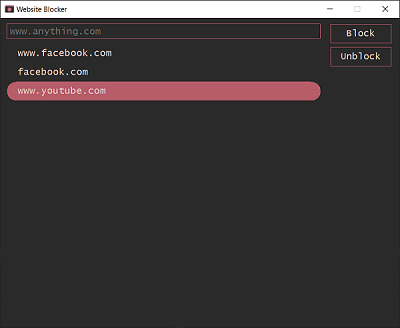
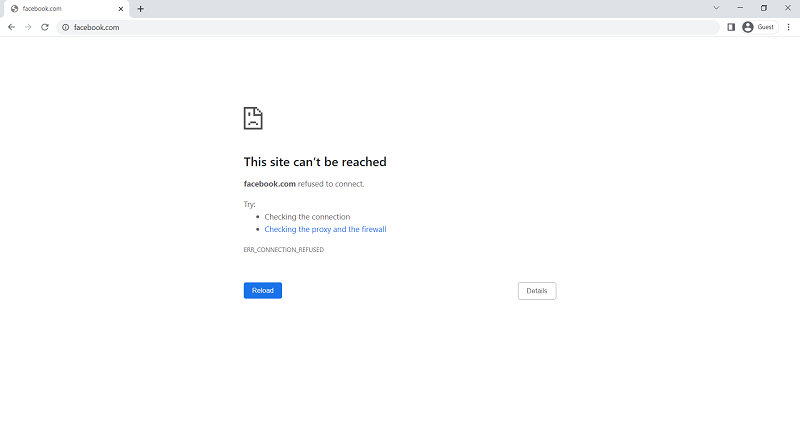

Website Blocker
---------------

Very simple app for Windows that blocks a website by 
adding a new rule in the hosts file



Hosts file contents:

```
127.0.0.1 www.facebook.com
127.0.0.1 facebook.com
127.0.0.1 www.youtube.com
```

